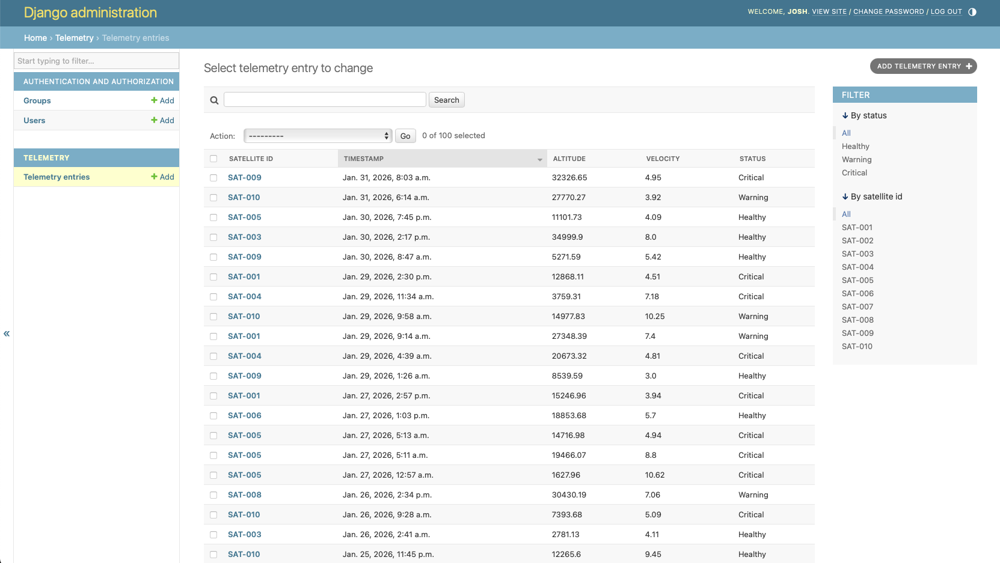
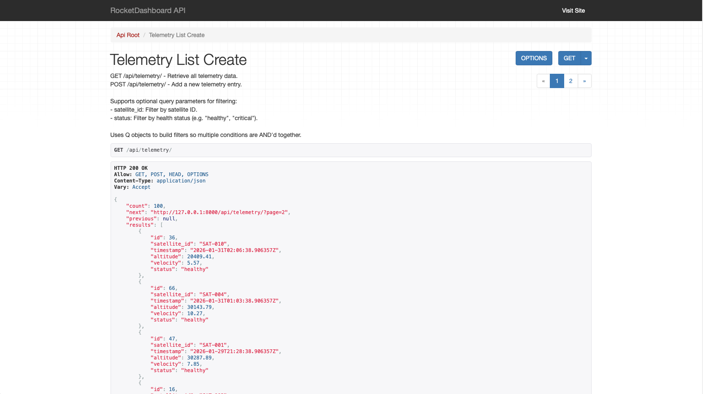

# RocketDashboard

A satellite telemetry dashboard built with Django REST Framework and React 18.

## Why Django

Django was chosen because it provides robust built-in user authentication, security permissions, and role-based access control that can be enabled when needed. The ORM includes model-level type checking and validation out of the box, so data integrity is enforced at both the serializer and database layers without extra libraries. The project does not currently require user login, but Django's auth system can be turned on with minimal changes if needed in the future.

## Screenshots

### Frontend — Telemetry Dashboard


The React SPA at `http://localhost:5173/telemetry/`. Filter by satellite ID or health status, add new entries, and edit or delete existing ones. Pagination is shown at the bottom.

### Django Admin


The Django admin panel at `http://localhost:8000/admin/`. Provides a built-in interface for managing telemetry entries with search, filtering by status and satellite ID.

### Browsable REST API


The Django REST Framework browsable API at `http://localhost:8000/api/telemetry/`. Returns paginated JSON and supports query parameters for filtering.

## Quick Start (Docker)

Run the entire app with no local dependencies — just [Docker](https://www.docker.com/get-started/):

```bash
make dev-up
```

Or equivalently:

```bash
docker-compose up --build
```

This builds a single container that runs migrations, seeds the database, and starts both servers. Visit `http://localhost:5173` when ready. When you want to bring the contianer down then type:

```bash
make dev-down
```

If you need to create a user then ```make superuser``` while a container is running will allow you to specify a username, email, and password in terminal.

NOTE: When using docker, it will delete all entries in the database and repopulate every time you bring it up. Refer to line "python manage.py setup_db" in the docker-entrypoint.sh file.

## Requirements (local development)

- Python 3.11+
- Node.js 20+

## Installation & Setup

NOTE: These instructions are for running without docker. If you have npm and python on your machine, you can run the servers directly on your machine. Use the following commands.

```bash
make setup
```

This will install Python and Node dependencies, run migrations, and seed the database with sample telemetry entries.

To start the development servers:

```bash
make runserver
```

Then visit `http://localhost:5173`.

To stop the servers:

```bash
make stopserver
```

Run `make help` to see all available commands.

## Project Structure

```
RocketDashboard/
├── manage.py
├── Makefile
├── requirements.txt
├── package.json
├── tsconfig.json
├── vite.config.ts
├── vitest.config.js
├── playwright.config.js
├── index.html
├── Dockerfile
├── docker-compose.yml
├── docker-entrypoint.sh
│
├── RocketDashboard/           # Django project configuration
│   ├── settings.py
│   ├── urls.py
│   ├── wsgi.py
│   └── asgi.py
│
├── apps/                      # Django apps
│   └── telemetry/
│       ├── models.py
│       ├── admin.py
│       ├── management/
│       │   └── commands/
│       │       └── setup_db.py
│       ├── api/               # REST API
│       │   ├── views.py
│       │   ├── serializers.py
│       │   └── urls.py
│       └── tests/             # Backend tests
│           ├── test_models.py
│           └── test_api.py
│
├── src/                       # React frontend (TypeScript)
│   ├── main.tsx               # Entry point
│   ├── App.tsx                # Routes
│   ├── api.ts                 # Typed fetch wrappers
│   ├── types.ts               # TypeScript interfaces
│   ├── components/
│   │   ├── Navbar.tsx
│   │   ├── Layout.tsx
│   │   └── telemetry/
│   │       ├── FilterBar.tsx
│   │       ├── AddEntryForm.tsx
│   │       ├── TelemetryTable.tsx
│   │       ├── TelemetryRow.tsx
│   │       ├── Pagination.tsx
│   │       └── AlertBanner.tsx
│   └── pages/
│       ├── HomePage.tsx
│       ├── TelemetryPage.tsx
│       └── NotFoundPage.tsx
│
├── e2e/                       # Playwright end-to-end tests
│   └── telemetry.spec.ts
│
└── .github/
    └── workflows/
        └── ci.yml             # GitHub Actions CI
```

### Architecture

The frontend is a React 18 SPA served by Vite on port 5173. During development, Vite proxies `/api/` requests to the Django backend on port 8000. The Django REST API is unchanged and can also be accessed directly at `http://localhost:8000/api/`.

### App structure

All Django apps are kept in the `apps/` directory to separate them from the main `RocketDashboard/` project configuration folder. Each app uses the `apps.` prefix in its namespacing (e.g. `apps.telemetry`) which is reflected in `AppConfig.name` and `INSTALLED_APPS`.

## Navigating the Application

- **Home** (`/`) - Landing page with a link to the telemetry dashboard.
- **Telemetry** (`/telemetry/`) - The main dashboard. View, filter, add, edit, and delete telemetry entries. Filters apply automatically when changed.
- **API** - Click the "API" link in the navbar to go directly to the Django REST Framework browsable API at `http://localhost:8000/api/`.

## REST API

The API is built with [Django REST Framework](https://www.django-rest-framework.org/). The browsable API interface is available at `http://localhost:8000/api/`.

- Browse to `/api/telemetry/` to see all telemetry entries.
- Use the built-in HTML form at the bottom of the page to submit new entries directly.
- Navigate to an individual entry (e.g. `/api/telemetry/1/`) to update or delete it.
- See validation error messages rendered automatically by the Django backend if you submit invalid data (e.g. negative altitude, invalid timestamp format).


### Endpoints

| Method | URL                    | Description                                        |
|--------|------------------------|----------------------------------------------------|
| GET    | `/api/`                | API root with links to available endpoints          |
| GET    | `/api/telemetry/`      | List all entries (supports `?satellite_id=` and `?status=` filters) |
| POST   | `/api/telemetry/`      | Create a new telemetry entry                        |
| GET    | `/api/telemetry/<id>/` | Retrieve a single entry                             |
| PUT    | `/api/telemetry/<id>/` | Update an entry                                     |
| DELETE | `/api/telemetry/<id>/` | Delete an entry                                     |

### Validation

- `timestamp` must be a valid ISO 8601 datetime.
- `altitude` and `velocity` must be non-negative numbers.
- `status` must be one of: `healthy`, `warning`, `critical`.

## Testing

### Backend (pytest)

```bash
make test-pytest
```

Runs the Django test suite with pytest. Coverage report:

```bash
make coverage
```

Fails if coverage drops below 80%.

### Frontend (vitest)

```bash
make test-react
```

Runs React component and API unit tests with vitest.

### End-to-end (Playwright)

```bash
make test-e2e
```

Starts Django automatically and runs Playwright tests against the full stack in Chromium and Firefox. Covers navigation, CRUD operations, filtering, and pagination.

## Notes

- The bootstrap css files are stored locally so that this web app works on an air-gapped intra-net.
- For production I would use gunicorn and nginx for reverse proxy and serving the app.
- In a real prod env, I would probably use fastAPI instead of Django since I am not using the front end and leavaging all the tools Django has.
- I can overwrite the basic Django templates for rest API and 404 errors for unique links and messages.
- Makefiles allow me to put commands that would normally go in a "scripts" folder into one convenient location.
- Much like the internal Django HTML templates, I can overwride their internal command system by putting my own code in /management/commands/. I use this for the `setup_db` command.
- `make help` lists all available Makefile commands.
- User can click on any of the headers to sort by ascending or descending.

## TODO

- Remove the Django frontend views.py and the templates folder since they are no longer used. Django will serve only the rest API and the backend database.
